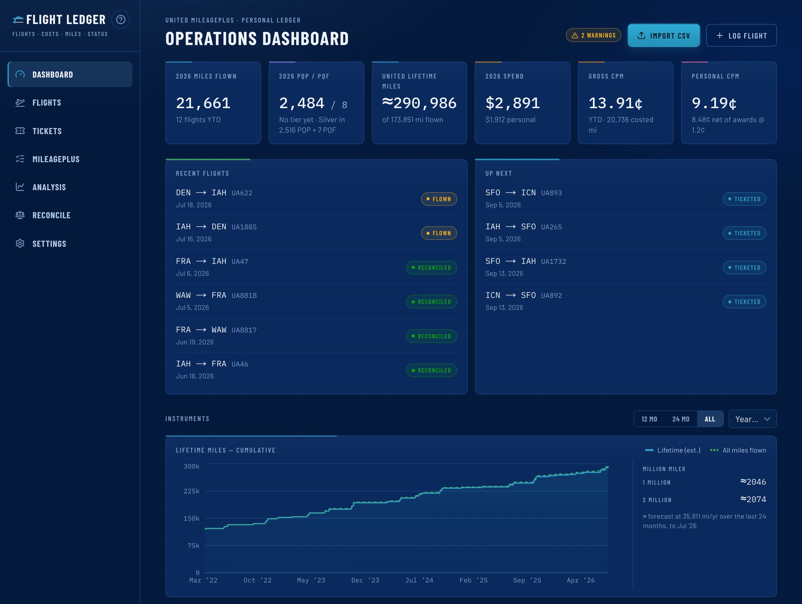
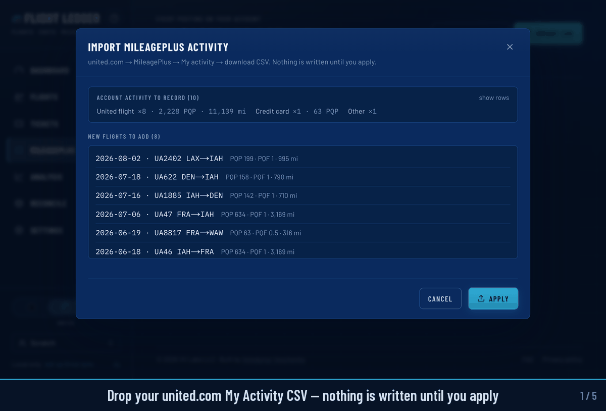

# Flight Ledger

Flight Ledger is a private ledger of your flying: every flight, what it
cost, what United credited for it, and whether those numbers agree. 
While flight trackers help with your next departure, the Flight Ledger helps you understand
the flying you've already done and how your MileagePlus account is performing. 
It runs client-side, entirely on your own machine.

### [Try it now at app.flightledger.net](https://app.flightledger.net)

Nothing to install, no account to create. The whole app runs inside your
browser (SQLite compiled to WebAssembly), and your ledger stays there.
No ledger contents are uploaded to a third-party server. 
You do have an option to turn on Google Drive sync for backups and multi-device access.
One click loads a demo ledger if you'd rather look around before
importing anything.



## Backstory

I built Flight Ledger to make sense of my own flying. I have been based near
SFO and IAH, both United hubs, and fly frequently for work. My flight history
was scattered across airline accounts, MileagePlus activity, and email
receipts.

I wanted one private place to see where I had flown, what it cost, and whether
United had credited it correctly, without signing up for another service,
logging into multiple accounts, or digging through old receipts.

## Quick start

1. Download your "My Activity" CSV from united.com (MileagePlus → My
   Activity).
2. Drop it on the Flights page. That one file builds your flight history
   and starts the Premier tracker: PQP and PQF against the thresholds
   United published for each year, drawn as the same arc gauges united.com
   uses, plus lifetime miles and Million Miler progress.
3. Add more when you feel like it. You can also import a **Flighty** or **myFlightradar24**
   CSV to bring years of history on any airline, aircraft types and tail
   numbers included. The email receipts add the money side. 
   The app tells the formats apart on its own.

Re-importing the same file changes nothing, so pull a fresh CSV whenever
you like. And export a backup from Settings once you're set up. 

Not that your ledger has no cloud copy by default.
To back up your data in the cloud, you can turn on Google Drive sync. 



## Where Flight Ledger is different

Feed it your email receipts and it becomes an accounting tool. Drop `.eml`
files or a whole Gmail label exported through Takeout. It recognizes 23
receipt formats, covering United, American, Delta, Southwest, Alaska,
Lufthansa and others, plus bookings made through Amex, Chase, and Capital
One travel portals. Then:

- A reissued ticket is priced as one economic unit across the flights that
  actually flew, so the value carried between tickets is not counted
  twice.
- Refunds and reimbursements tracking. Separate business and out-of-pocket costs.
- Cost per mile (CPM) in gross, personal, and per-route flavors.
- Cash flow gets its own view.
- Whatever doesn't line up lands in a reconcile queue: flights United never
  credited, duplicates, foreign-currency tickets counted at 1:1, clocks
  that disagree with the distance.

## Also in the box

Statistics, mostly: a zoomable route map drawn from bundled
data, the total miles you've flown, 
a sortable table of every route you fly, fleet statistics down to
individual airframes enriched from the FAA registry, travel mix,
fare-class economics, and a printable annual report.
Estimates wear a `≈` symbol, and a value you typed
by hand is not overwritten by an import. 
The reasoning behind each rule
lives in the [docs](#documentation).

## Your data

Your ledger stays local by default. In the browser build it lives in your
browser's own storage (OPFS); "clear site data" deletes it, so export
backups. Self-hosted, each account is one SQLite file under `data/`, and the
server binds to `127.0.0.1` only.

One exception is Google Drive sync. 
If you turn it on, copies the backup
from your browser to a private folder of your own Drive when you press
sync. The public site also counts page views, but never sees ledger
contents. Details in the
[privacy policy](https://app.flightledger.net/privacy).

## Self-hosting and development

```bash
npm install
npm run dev
```

Open <http://localhost:3000>. To explore with sample data first, press
"Load demo data" on the empty dashboard and erase it later from Settings →
Erase all data. Requires Node 22.13 or newer, the first release where
`node:sqlite` runs without a flag.

`npm run build:browser` exports the entire app as static files (`out/`)
that run with no server at all; serve them from any static host. For a
project path, rebuild with `-- --base /path`. For the official
flightledger.net deployment, copy `.env.example` to `.env`; a deployment on
any other origin needs its own Google OAuth client ID for Drive sync.

## Commands

| Command | What it does |
|---|---|
| `npm run dev` | Start the dashboard |
| `npm run build && npm start` | Production build and serve (uses `.next-build/`, so it won't disturb a running dev server) |
| `npm run selftest` | 944 checks over distance, cost allocation, parsing and status math, plus a 500-case fuzz |
| `npm run typecheck` | TypeScript check |
| `npm run lint` | ESLint over `src/` and `scripts/` (Next's recommended rules, flat config) |
| `npm run seed:demo` | Populate sample data (needs a running server) |
| `npm run airports:build` | Refresh the bundled airport dataset from OurAirports |
| `npm run fleet:build -- <dir>` | Rebuild the tail-number to aircraft-type table from a hand-downloaded FAA Releasable Aircraft Database |
| `npm run map:build` | Refresh the bundled world outline (Natural Earth) |
| `npm run wasm:assets` | Copy the SQLite-WASM binary into public/ (browser engine) |
| `npm run build:browser [-- --base /path]` | Export the whole app as static files running on the in-browser engine (`out/`) |
| `npm run bis:build` | Rebuild the published-mileage lookup table |

## Stack

Next.js 15 (App Router), TypeScript, Tailwind CSS v4, Recharts, d3-geo, and
Node's built-in `node:sqlite` (no ORM, no native modules). Fonts, airports,
and map data are bundled, with no third-party runtime data services.

## Documentation

| Document | What's in it |
|---|---|
| [Design](docs/flight-ledger-design.md) | Data model, metrics, workflows, import architecture |
| [Import formats](docs/importers.md) | What each email and CSV format does differently, and why |
| [Accounting rules](docs/accounting.md) | What gets counted, what doesn't, and the reasoning behind each rule |

## Status

Flight Ledger is in daily use. 
All the data imports are manual by design: you feed
it files, and nothing happens without you.
The app does not connect to your Gmail or poll airlines on a schedule. 


## License

[MIT](LICENSE). Redistributed third-party material keeps its own terms:
the Barlow and IBM Plex Mono fonts (SIL OFL 1.1) and eighteen test
fixtures from two MIT-licensed corpora, inventoried in
[THIRD_PARTY_NOTICES.md](THIRD_PARTY_NOTICES.md) with full license texts
under `licenses/`. The bundled datasets are public domain or public data:
OurAirports, Natural Earth, the FAA aircraft registry, and the BIS
city-pair table, which credits the FlyerTalk thread it was compiled from
in its header.

---

Not affiliated with or endorsed by United Airlines. "United", "MileagePlus"
and "Premier" are their trademarks, used here only to describe what this
tool reads.
