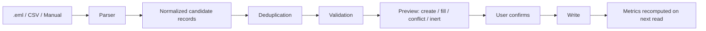
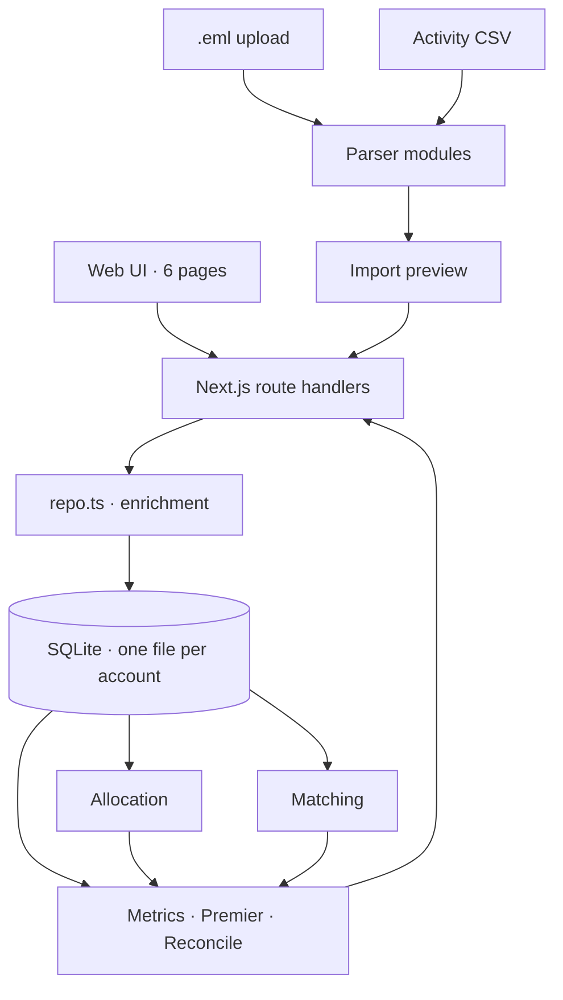

# Flight Ledger — United flights, costs & MileagePlus — Application Design

This document describes the application as it is built. It began as a forward
plan and has been rewritten against the implementation; where the build
departed from the original design, the section says so and gives the reason.

Anything specified but not implemented is marked **Not built** with a short note
on where it stands. Nothing here describes behaviour that doesn't exist.

Two companion documents go deeper on the parts that carry the most reasoning:
[accounting.md](accounting.md) for what gets counted and what doesn't, and
[importers.md](importers.md) for what each email format does differently.

Section numbers are stable — source comments cite them (`design doc §7.2`) — so
they are not renumbered even where a section's content has changed.

## 1. Overview

### 1.1 Product summary

Flight Ledger is a local web application for recording United and United-related
flights, reconciling them with MileagePlus activity, and analyzing travel costs
month by month.

It tracks several concepts that are often conflated:

- Physical flight distance
- United lifetime-flight miles
- Redeemable MileagePlus award miles
- Premier Qualifying Points (PQP)
- Premier Qualifying Flights (PQF)
- Gross ticket cost
- Net personal cost after reimbursements
- Cost per mile (CPM)

Data capture is automatic where practical — email receipts, activity CSV — and
every imported value stays reviewable and editable.

### 1.2 Primary user

A frequent United traveler who wants to understand:

- How many flights and miles were flown each month
- How quickly lifetime-mile totals are increasing
- How much airfare was purchased
- How much was personally paid after reimbursements
- How efficiently cash was converted into flown miles, PQP, and award miles
- Whether every completed flight posted correctly to MileagePlus

### 1.3 Product principles

These are load-bearing. Several sections below exist only because of them.

1. **Authoritative data wins.** United-posted values override estimates.
2. **Estimated and confirmed values are visibly different.** Estimates carry a
   `≈` marker everywhere they appear, including in column totals.
3. **No silent accounting decisions.** Allocations, exclusions, inferred
   exchange links and ambiguous matches are all shown and reversible.
4. **Manual correction is always possible.**
5. **No credentials are stored.** The application has no accounts, no
   passwords, and no outbound network calls.
6. **The application stays useful with only manual or CSV import.**

---

## 2. Goals and non-goals

### 2.1 Goals

All of the following are implemented:

- Maintain a complete flight ledger
- Import United confirmation and receipt emails
- Import MileagePlus activity from the united.com CSV
- Calculate distance for each segment
- Reconcile booked segments with completed flights and MileagePlus postings
- Track monthly, annual, and lifetime totals
- Calculate multiple CPM variants
- Handle reimbursements, travel credits, refunds, and award tickets
- Identify missing or inconsistent postings
- Export all user data

### 2.2 Non-goals

The application does not:

- Purchase or change flights
- Check in for flights
- Store United.com credentials
- Scrape United.com
- Replace an expense-management system
- Estimate the subjective value of elite status
- Determine tax deductibility
- Provide corporate accounting or audit certification
- Guarantee exact United lifetime-mile calculations before United posts them

One original non-goal was dropped: the first version was to be United-only, and
the schema is now carrier-neutral. Parsing and terminology stay
United-optimized, but American, Alaska and Lufthansa tickets are first-class
records — they cost money and fly miles like any other. See §10.

---

## 3. Key terminology

### 3.1 Flight segment

One nonstop operated flight from one airport to another. `IAH → SFO` is one
segment. The segment is the unit everything else attaches to.

### 3.2 Ticket

A purchased or issued transportation document with a ticket number. One ticket
may cover several segments and may be exchanged or reissued.

**The ticket is also the grouping unit.** An earlier design had a separate
`trips` concept — a named container lending its segments a default purpose.
It was removed. The grouping that turned out to matter is the one money is
attached to, and a trip was a second, weaker answer to a question the ticket
already answered. `dropTripsFeature` in [db.ts](../src/lib/db.ts) migrates
databases that predate the removal.

Where a trip-shaped view is still wanted — a whole itinerary's cost — the
exchange chain provides it: see §6.5.

### 3.3 Flown distance

How far the aircraft actually went. See §9 — this is deliberately not the same
quantity as credited mileage.

### 3.4 United lifetime miles

United-posted miles counting toward Million Miler. These differ from distance
and are not available for every flight.

### 3.5 Award miles

Redeemable MileagePlus miles credited for a flight or related activity. An
explicit `0` is the award-travel signature: award tickets earn PQP and PQF under
current rules but never redeemable miles.

### 3.6 PQP / PQF

Premier Qualifying Points and Premier Qualifying Flights, as credited by United.

### 3.7 Gross cost

The total monetary cost of the ticket before reimbursements.

### 3.8 Personal cost

What the user ultimately bore, after reimbursements, refunds, statement credits
and employer payments.

---

## 4. Core metrics

Metrics are computed at segment, month, year and lifetime level in
[metrics.ts](../src/lib/metrics.ts). They are computed on read — there is no
snapshot table to invalidate.

### 4.1 Gross travel CPM

```text
Gross CPM = 100 × gross allocated cost / flown distance
```

Cents per flown mile.

### 4.2 Personal CPM

```text
Personal CPM = 100 × net personal allocated cost / flown distance
```

Deliberately over the SAME miles as gross CPM — reimbursed flying included —
so the two are one subtraction apart: gross minus personal is what someone
else paid per mile. The other question, what personally-paid travel itself
costs per mile, is a different basis and lives in the travel mix's Personal
slice; folding it into this column would put two rulers in one table.

### 4.3 Lifetime-mile CPM

```text
Lifetime-mile CPM = 100 × allocated cost / United lifetime miles
```

Reported alongside 4.1 and 4.2 over the identical numerator, so the two are
directly comparable. They diverge on short hops, where 326 miles in the air
credit 500.

### 4.4 Cost per PQP

```text
Cost per PQP = eligible allocated cost / PQP
```

Dollars per PQP, not cents per mile. Its basis is wider than the CPM basis:
non-UA flights earn PQP, so they count here.

### 4.5 Award-mile rebate value

```text
Award-mile rebate = award miles earned × configured cents-per-mile valuation
```

The valuation is a setting and is labeled an assumption wherever it surfaces.

### 4.6 Effective net CPM

```text
Effective net CPM = 100 × (personal cost - estimated award rebate) / flown distance
```

Shown beside personal CPM, never instead of it.

### 4.7 The restricted basis

Every aggregate CPM figure is averaged over **flown flights that have a recorded
cost and earn lifetime miles**. Imported history without tickets, award travel
and non-UA flights are excluded, because each would drag cents-per-mile toward
zero and make the average meaningless.

The interface discloses the basis in miles rather than hiding it. Per-flight
rows still show their own numbers; only the averages are restricted. Physical
totals — miles, spend, PQP — always include everything.

A parallel `≈` series additionally reconstructs uncosted flights from their PQP
(§7.4) and is reported as a separate figure, never merged into the strict one.

---

## 5. Functional requirements

## 5.1 Flight ledger

Implemented. The user can add a segment manually, edit any imported flight,
group segments under a ticket, store marketing and operating carriers
separately, store cabin and booking class, store departure and arrival times,
store seat, aircraft and confirmation code, tag purpose, and add notes.

**Segment statuses** — five, not the eight originally suggested:

- `ticketed`
- `flown_unreconciled`
- `flown_reconciled`
- `canceled`
- `missed`

Two were retired. `planned` and `ticketed` were read identically everywhere —
both meant "not flown yet", and "nothing bought yet" is already legible from a
flight with no ticket attached. `refunded` and `canceled` were likewise
identical in every code path: neither allocates cost, neither earns. The
distinction `refunded` reached for — whether the money came back — belongs on
the ticket, where it lives as a ticket status and a refund adjustment, because a
refund is granted per ticket and not per leg.

`RETIRED_SEGMENT_STATUSES` in [types.ts](../src/lib/types.ts) records the
mapping and `retireSegmentStatuses` applies it on open. The ticket status
`refunded` is unaffected.

**A flight becomes flown by landing.** On every enriched read, a sweep
(`advanceArrivedLegs` in repo.ts) moves any `ticketed` leg past the arrival
boundary — scheduled arrival plus a six-hour margin where the schedule is
known (arrival.ts), the day rule where it isn't — to `flown_unreconciled`.
Cancelled stays cancelled, flown and reconciled rows are never touched, and
every advance is logged under the `arrival` actor so Recent changes answers
"who marked this flown" with "it landed". One deference: a ticketed leg on a
ticket with a SUCCESSOR is a reissue leftover, and the clock cannot tell
"landed" from "reissued away before departure" — there the sweep applies the
exchange's own rule instead (issued before the leg's date and not carried by
the new itinerary → cancelled; the boundary day stays a question for the
receipt re-import). Reconciliation remains evidence-only — the sweep says
you flew, and only a MileagePlus posting says United agrees.

**Not built:** file attachments on a segment. Notes carry what has been needed.

## 5.2 Ticket and cost tracking

Implemented, split across three tables. The ticket carries base fare,
surcharges, taxes, ancillary fees, gross total, currency and exchange rate
(§8.4). How it was funded is a separate concern and lives in `payments` (§8.6):
card, cash, TravelBank, future flight credit, travel certificate, gift card,
miles, other. What came back afterwards lives in `adjustments` (§8.7):
reimbursement, refund, statement credit, employer payment, correction.

Splitting funding from cost is what lets a ticket be paid three ways at once and
still reconcile. Both original currency and reporting currency are preserved.

A future flight credit is treated as cash — a ticket bought with one costs its
face value. This is not a credit tracker.

## 5.3 MileagePlus activity tracking

Implemented. Every row of the activity export is recorded, flight and non-flight
alike, with activity date, posting date, description, type, carrier, flight
number, route, award miles, PQP, PQF, match status, score, explanation, source
and dedup key.

Activity types: `united_flight`, `partner_flight`, `credit_card`, `hotel`,
`car_rental`, `shopping`, `dining`, `rideshare`, `ancillary`, `promotion`,
`adjustment`, `redemption`, `other`.

`ancillary` was added after the fact: paid extras on a United flight earn PQP —
a day-of-departure upgrade is worth hundreds — and `other` was hiding a real
earning source.

Flight analytics distinguish flight-earned miles from non-flight activity
throughout. Flight-type activity rows are deliberately skipped when totalling
PQP from segments, since they are the same flights and counting both would
double every trip.

Premier qualification is computed from both halves in
[premier.ts](../src/lib/premier.ts): flight PQP from segments, non-flight PQP
from activity.

## 5.4 Monthly summaries

Implemented, all fields present: segments flown, distance, United lifetime
miles, award miles from flights, award miles from all sources, PQP, PQF, gross
allocated to the month, net personal, gross CPM, personal CPM, cost per PQP,
missing-posting count.

Trips flown is gone with §3.2. Unmatched-activity count moved to the reconcile
report (§5.6) rather than the monthly row.

## 5.5 Annual and lifetime summaries

Implemented: year-to-date totals, an annual table giving prior-year comparison,
lifetime totals, rolling CPM over a configurable window, and most frequent
routes **with their cost per mile**.

Route CPM (`summarizeRoutes` in [metrics.ts](../src/lib/metrics.ts)) reads a
city pair undirected, since a round trip is bought as one fare and reading the
legs apart would split every itinerary down the middle; the directions flown are
kept for the case where they genuinely differ, such as a paid outbound against
an award return. Its cost sits on the §4.7 basis while its distance counts every
flight on the pair, so the row reports the n behind the figure rather than
letting a one-of-four CPM pass for the route's.

Rolling figures are **weighted** — the window sums cost and miles separately and
divides once — because CPM is a ratio, and averaging monthly ratios gives a
month with one cheap hop the same say as a month with twenty long-hauls. A point
appears only once the window is full: a "12-month average" plotted at month
three is a three-month average wearing the wrong label.

**Million Miler forecasting** (`forecastLifetime`) projects each lifetime rung
from the miles credited over a trailing 24-month window, reported beneath the
cumulative chart. It is a straight line through a lumpy history, so the output
is shaped to carry only what that supports:

- a **year**, never a date, carrying the `≈` this app puts on every estimated
  figure, and always printed beside the rate and window it came from — a
  projection read without its assumption is a date someone plans around;
- **nothing at all** below twelve complete months, since travel has a season and
  half a year rates a summer flyer as though every month were July;
- the **month in progress excluded**, or the same ledger would forecast
  differently on the 1st and the 28th;
- rungs more than 50 years out **dropped, not dashed** — a placeholder occupies
  the width of an answer to say there isn't one.

A rung already **crossed** is not forecast at all. It reports the month the
running total passed it, read off the same cumulative series the chart draws, so
the date a rung is said to have fallen is the date the chart shows it falling.
A rung inside the lifetime baseline reports that it was reached and no month:
the miles are real and the crossing is not in evidence, which is a different
statement from not having reached it.

Its `current` is the figure the dashboard card already shows, not a second
reading of lifetime miles.

**Travel mix** (`summarizeMix` in [mix.ts](../src/lib/mix.ts)) cuts the same
flown segments three ways — business versus personal, United metal versus every
other airline's, domestic versus international — plus the busiest airports. Each
dimension partitions the whole, so the three mile totals agree with each other
and with the ledger; a slice that quietly dropped or double-counted a flight
would still look plausible on screen, so that invariant is tested rather than
assumed.

Purpose comes from `effective_purpose` rather than from comparing gross against
personal cost. That is already this app's one answer to "was this work?" — the
flight's own purpose where set, business inferred from a reimbursed ticket
otherwise — and on a ledger that rarely sets purpose by hand, the inference is
where the signal is.

The carrier split is **"other airlines", not "partners"**: Delta and American
are competitors, and a regional like SkyWest flies for whoever holds the
contract. The dimension asks whose metal you were on, which says nothing about
an alliance.

**Mix CPM uses a wider basis than §4.7**, the only place in the app that does.
The aggregate basis also demands lifetime-mile credit, which no non-UA flight
earns — defensible for a headline about United earning, fatal here, since it
leaves one whole side of a comparison structurally unanswerable rather than
merely unknown. `pricesInCash` keeps out what actually distorts a
cents-per-mile figure: flights with no cost recorded, and award travel, where a
few dollars of tax over a long flight reads as almost free. Another airline's
metal does neither, so it prices. Every slice states its own n, and the
difference in basis is disclosed on hover.

The panel lives on the **Analysis page** (§12.8) and **follows its range
control**, and names the window it is showing — a share means nothing
without the period it is a share of. That is why the computation lives in
`mix.ts` rather than the analytics payload: the range is UI state the server
never sees, so the mix is computed in the browser from the flight list. Like
`rollingCpm`, it is kept out of [metrics.ts](../src/lib/metrics.ts) because that
module reaches the database and a value import from it would drag `node:sqlite`
into the client bundle.

**Fare classes** (`summarizeFareClasses`) report what each booking class cost
per mile and what it bought in status, following the same range control.

The class is recorded verbatim and nothing is read off its letters. On this
ledger `XN`, `YN` and `IN` are award fares while `PZ` and `RN` are cash ones, so
neither length nor prefix separates them — only the recorded award signature
does. Classes are ordered by how much each was flown and never ranked: the same
`PZ` covers a domestic First recliner and a lie-flat Polaris seat, and the IATA
cabin tier does not rescue that, since the airline files it that way.

Classes are also keyed by the **marketing carrier**, because a booking class is
the airline's own namespace — this ledger's `V` spanned United, Lufthansa and
Alaska fares with nothing in common but the letter, and blended they quoted a
¢/mi nobody ever paid. The marketing carrier rather than the operating one: a
codeshare is booked in the seller's inventory whoever flies it. (The travel
mix's "metal" split uses the operating carrier — a different question.) Rows
without a tag are United's; the rest name their airline, in the Premier
breakdown's own convention. Flights with no class recorded get a row of their
own per airline rather than vanishing — the Premier breakdown's Lyft rule
again: the question "which of my flying is unclassified" is answered by seeing
the row.

**$/PQP excludes award bookings from both halves of the ratio.** An award
booking earns real points for no fare, so leaving its PQP in the divisor makes
the class it sits in look like it buys status nearly free.

The figures bear out §7.4's premise, incidentally: cost per PQP lands between
$1.09 and $1.20 across every class on a real ledger, which is what "PQP ≈ base
fare, plus tax" predicts. Cents per mile is where classes actually differ,
ranging 8.5¢ to 22.5¢.

**Award-mile valuation scenarios** report effective CPM across a band of
valuations (1¢, 1.5¢, 2¢, plus whatever is configured) beside the headline
figure. §4.5 requires the valuation to be labelled an assumption; the band says
how much the answer depends on it. On a real ledger the spread runs 2.39¢ to
1.48¢, so it depends a great deal — which is the point of showing it.

**Median segment CPM** (`flightCpmSpread`) is the counterpart to every
weighted mean in the app: one vote per flight instead of per mile, reported
with the p10–p90 band, because the spread is what the average erases — on a
real ledger the mean was 13.8¢, the median 12.9¢, and the band ran 9.2¢ to
26.4¢. Shown in plain words under the monthly ledger ("half of your 178
cash-paid flights cost under…") and on the annual report. With this, §5.5's
original list is complete.

## 5.6 Reconciliation and exceptions

Implemented in [reconcile.ts](../src/lib/reconcile.ts), computed on read.
Fifteen exception kinds:

| Kind | Raised when |
|---|---|
| `missing_posting` | flown, past the configured delay, no posting recorded |
| `unmatched_activity` | flight activity with no candidate segment |
| `suggested_match` | scored in the review band, awaiting a decision |
| `duplicate_segment` | same date, route and flight number twice — live copies only; a canceled coupon beside its rebooking is history, not a double entry |
| `duplicate_activity` | same posting imported twice |
| `broken_chain` | two tickets claim the same predecessor — a reissue chain is a line, and a fork spends the original's value twice |
| `duplicate_ticket` | one eTicket number on two ticket rows |
| `unconverted_currency` | foreign-currency ticket still held at 1:1 |
| `no_cost` | flown flight with nothing allocated |
| `unknown_airport` | code not in the bundled dataset, so no distance |
| `allocation_warning` | a ticket's allocation raised a warning |
| `payment_mismatch` | funding doesn't reconcile to the cash total |
| `fare_parts_mismatch` | fare parts don't sum to the stated total |
| `exchange_double_count` | chain economics would count a dollar twice |
| `unlinked_exchange` | credit-funded ticket whose source could be in the ledger |
| `ready_to_reconcile` | postings arrived; the segment can be marked reconciled |

Each is confirmable or dismissable in place on the Reconcile page.

Two original items are handled differently than specified. "Mismatched origin or
destination" and "mismatched flight date" are not separate exceptions — they are
features of the match score (§11.2), which explains the disagreement in words
rather than raising a second alert about it. "Reimbursements greater than ticket
cost" is prevented at write time instead (§17), so it cannot become an
exception.

The delay before a missing posting is raised is the `missing_posting_delay_days`
setting, default 7.

---

## 6. User workflows

## 6.1 Initial setup

1. `npm install && npm run dev`. There is no account creation and no login — the
   ledger is a file on disk.
2. The user sets reporting currency, award valuation, and a lifetime-mile
   baseline in Settings.
3. The user picks an import path: `.eml` receipts, the activity CSV, or manual
   entry.
4. Historical flights are imported.
5. Unmatched and low-confidence items are reviewed on Reconcile.

Additional ledgers are created from the sidebar switcher; each is a separate
database file (§8.1).

## 6.2 Import a new itinerary

1. `.eml` files are dropped anywhere on the Tickets page, or picked through
   **Import receipts**.
2. The parser extracts ticket, itinerary and cost data (§10.3).
3. Existing records are searched for duplicates and for tickets this document
   supersedes.
4. A review dialog shows exactly what will be created, filled in, or left alone,
   and why.
5. The user confirms or edits before anything is written.

Nothing is written outside the preview's classification. A batch is analyzed as
a whole, so a reissue chain dropped in together links up in one pass.

## 6.3 Reconcile after travel

1. The flight date passes; the segment is marked flown.
2. Activity CSV is imported.
3. The matching engine scores candidates (§11).
4. Matches at or above the automatic threshold link on import; the review band
   becomes suggestions.
5. Posted PQP, PQF, award and lifetime miles are copied to the segment.
6. The segment becomes `flown_reconciled`.

Values that contradict what the user entered become per-row conflicts — "Use
United's" or "Keep mine" — rather than being overwritten.

## 6.4 Add reimbursement

The common case is "work paid for all of it", so that is one tick: it records
the ticket's full reimbursable cost, dated today. Partial amount, date and payer
sit beside it for when there is something to refine. Unticking removes the
reimbursements it stands for, which are listed above it first so nothing
disappears without having been visible.

"In full" means gross less refunds — not what's left after reimbursing it, which
would collapse to zero the moment the box was ticked.

Personal cost and personal CPM recalculate on read, so there is no reallocation
step.

## 6.5 Handle a ticket exchange

1. The original ticket is retained.
2. The reissue links to it through `predecessor_ticket_id`.
3. Superseded segments are canceled; a leg still attached to the replaced ticket
   moves to the reissue without asking, because that is what a reissue is.
4. Additional collection and residual credit are recorded, or inferred from the
   difference between consecutive face values when the receipt prints neither.
5. **The chain is costed as one economic unit** across the flights that actually
   flew: first ticket's face value, plus each reissue's additional collection,
   less any residual handed back.
6. Every member keeps its own face value and its own row, and the Tickets page
   folds the chain into one panel.

Step 5 is the whole point. A reissue is printed for the entire itinerary
*including* the value carried over from the ticket it replaced, so face values
overlap and adding them up overcounts. `allocateChain` in
[allocation.ts](../src/lib/allocation.ts) allocates once across the chain.

---

## 7. Cost-allocation rules

Ticket cost is allocated to segments so that months can be costed. Canceled
segments are excluded entirely; missed segments keep cost but earn nothing.

### 7.1 Supported allocation methods

**A. PQP-weighted** — `segment cost = allocable × segment PQP / total PQP`.
Preferred when segment PQP is known, since it tracks United's own fare
economics.

**B. Distance-weighted** — the same with distance. The usual fallback.

**C. Equal split** — allocable / segment count.

**D. Manual** — the user enters the amount per segment.

All four use largest-remainder rounding so the parts sum to the total exactly.
`distribute()` is the shared primitive and the property is fuzz-tested (§19.4).

### 7.2 Default hierarchy

1. Manual, where explicitly set
2. PQP-weighted
3. Distance-weighted
4. Equal split

A fifth state, `none`, means nothing is allocated — a flown flight with no
ticket behind it. It is not a method; it is the marker that keeps such flights
out of the CPM basis (§4.7).

**Pinned extras** sit outside the hierarchy: an "extra purchase" adjustment
whose `segment_id` names a live flight (an upgrade receipt prints its leg)
lands whole on that flight, gross and personal alike, after the pooled split.
Reimbursements offset the pooled cost first and only their overflow thins the
pinned amounts — the stated assumption (accounting.md) being that work pays
the fare and you pay the upgrade. Extras without a flight, or pinned to a
canceled one, join the pool and spread like fare, with a warning in the
canceled case.

### 7.3 Month attribution

Cost is attributed by **flight date** — travel-period accounting. That is what
every figure on the dashboard uses except one.

**Cash-flow accounting** (`buildCashFlow`) is the other view the original design
called for, and it is a separate structure feeding a separately labelled panel
on the Analysis page (§12.8)
rather than a column, because the rule is that the two must never be mixed
silently. A ticket lands on its `issue_date`, money back on the adjustment's
`effective_date`; nothing there is a flight date.

Outflow is `TicketAllocation.cashAt` — the NEW money a ticket cost — so an
exchange chain spreads across the dates its money actually moved instead of
landing wholly on the first ticket, and a reissue that hands value back shows a
negative month. That decomposition lives in `allocateChain` beside the inference
it depends on: the additional collection and the residual are usually derived
from consecutive face values, and a second implementation of that would be a
second answer waiting to disagree. Summed across a chain it equals `chain.cash`,
which the selftest asserts. On a real ledger it removes $13,241.95 of overlap
across 15 chained tickets — 27% of the naive sum of face values.

Inflow is every adjustment. Refunds, reimbursements, statement credits and
employer payments all return money, and the distinction that matters everywhere
else — whether it reduces gross or only personal — has no meaning for cash.

**An undated inflow is assumed into its ticket's purchase month, and marked.**
This is not an edge case: ticking "Reimbursed" deliberately records no date (see
[accounting.md](accounting.md)), so on a real ledger the entire inflow side can
be undated — $28,598.12 across 51 adjustments in one — and the first version of
this view, which refused to guess, drew every purchase and nothing coming back.
An empty answer was the more misleading one. What makes the guess admissible is
§1.3's convention: the assumed share rides on the month (`inAssumed`), the rows
and totals containing it wear the ≈, the notice above the table says what was
assumed, and a recorded date always replaces it. Money whose ticket has no
purchase date either stays off the table and is reported — there, nothing is
known, and nothing is claimed.

### 7.4 Cost estimation from PQP

Not in the original design; added because imported history has flights with
posted PQP and no surviving receipt.

United's PQP is revenue-based, so one PQP ≈ one dollar of base fare — measured
against this ledger's own receipts, the ratio holds within a fraction of a
percent. A flight with PQP and no ticket gets an estimated gross of
`PQP × (1 + tax rate)`, where the rates are learned from the user's own costed
tickets, split domestic and international, and overridable in Settings.

The estimate is never merged into recorded cost. It appears as `≈` in the ledger
and as a separate `≈ CPM` figure. Award travel is excluded, having been paid in
miles.

---

## 8. Data model

SQLite, through Node's built-in `node:sqlite`. No ORM. The schema lives as a
single `CREATE TABLE IF NOT EXISTS` block in [db.ts](../src/lib/db.ts), with
additive column migrations applied idempotently on open and two structural
migrations for features that were removed.

**Adding a column takes two edits, not one.** Writes go through per-table
allow-lists in [repo.ts](../src/lib/repo.ts) (`WRITABLE_FIELDS`), which gate
insert, update and backup restore alike by *silently skipping* any key not
named in them. A column added to the migration list and forgotten there reaches
the database never, with nothing thrown and nothing logged — which is how
`credits_mileageplus` spent its whole life unwritable while the form sent it,
validation accepted it and the importer set it. A selftest now holds the
allow-lists against the live schema (§19.1) so the next omission fails loudly.

The original design specified a multi-user relational schema — `users`, plus a
`user_id` on every table. That is gone; see §8.1.

## 8.1 Accounts

There is no `users` table. **Each account is a separate database file**, listed
in `data/accounts.json` alongside them.

This is a stronger guarantee than a `user_id` column. Two people's miles, status
years and costs must never be summed by accident, and the way to guarantee it is
for a query to have no way of reaching the other account's rows. Everything
downstream — backup, export, wipe, reconcile — operates on "the current
database" and became per-account without knowing accounts exist.

```text
data/
  accounts.json     registry: which ledgers exist, which is open
  <account>.db      one SQLite file each
  backups/
```

The registry sits beside the databases rather than inside one: a file cannot
hold the list of files, and "which account is open" must not require opening an
account first. `getDb()` resolves the path on every call and caches by resolved
path, so a stale handle can only ever point at the file it was opened for.

## 8.2 Airports

There is no airports table. The dataset is bundled as
[airports.json](../src/data/airports.json) — 8,800 scheduled-service airports
from OurAirports (public domain), with IATA, ICAO, name, city, country,
latitude, longitude — and versioned in-repo with its fetch date. `npm run
airports:build` refreshes it.

Bundling rather than storing keeps it identical across accounts, makes it
diffable in review, and lets the app work offline.

## 8.3 Ticket / segment relationship

*(This section held `trips`, which was removed — see §3.2. The numbering is kept
so later references stay valid.)*

A segment's `ticket_id` is nullable and `ON DELETE SET NULL`: deleting a ticket
must not delete the record that a flight happened. A ticket with no segments is
legitimate — a fully refunded purchase.

## 8.4 `tickets`

| Field | Type | Notes |
|---|---|---|
| `id` | TEXT | UUID primary key |
| `ticket_number` | TEXT | leading zeros preserved |
| `confirmation_code` | TEXT | |
| `issuing_carrier` | TEXT | defaults `UA`; a non-UA issuer means the flight credits elsewhere |
| `issue_date` | TEXT | YYYY-MM-DD |
| `currency` | TEXT | defaults `USD` |
| `exchange_rate` | REAL | defaults 1; reporting = gross × rate |
| `base_fare` | REAL | |
| `surcharges` | REAL | |
| `taxes` | REAL | |
| `ancillary_fees` | REAL | |
| `gross_total` | REAL | |
| `payment_method` | TEXT | free text; the structured form is §8.6 |
| `status` | TEXT | `active` / `exchanged` / `refunded` / `voided` |
| `predecessor_ticket_id` | TEXT | the ticket whose value funded this one |
| `residual_credit` | REAL | value handed back on reissue |
| `additional_collection` | REAL | new money collected on reissue |
| `notes` | TEXT | |
| `created_at`, `updated_at` | TEXT | ISO |

## 8.5 `segments`

| Field | Type | Notes |
|---|---|---|
| `id` | TEXT | UUID primary key |
| `ticket_id` | TEXT | nullable, `ON DELETE SET NULL` |
| `marketing_carrier` | TEXT | defaults `UA` |
| `operating_carrier` | TEXT | nullable |
| `flight_number` | TEXT | |
| `origin`, `destination` | TEXT | IATA |
| `flight_date` | TEXT | YYYY-MM-DD local departure |
| `departure_time`, `arrival_time` | TEXT | HH:MM |
| `cabin`, `booking_class`, `seat`, `aircraft` | TEXT | |
| `status` | TEXT | §5.1 |
| `purpose` | TEXT | nullable — null infers from the ticket |
| `distance_miles` | REAL | computed on write |
| `lifetime_miles` | INTEGER | United-posted, never overwritten by calculation |
| `credits_mileageplus` | INTEGER | null infers; 1/0 is the user's own answer |
| `award_miles` | INTEGER | `0` is the award-travel signature |
| `pqp`, `pqf` | REAL | posted |
| `projected_pqp`, `projected_pqf`, `projected_award_miles` | REAL/INTEGER | booking-time projections; planning data only |
| `manual_cost` | REAL | manual gross allocation override |
| `notes` | TEXT | |
| `created_at`, `updated_at` | TEXT | |

Indexed on `flight_date` and `ticket_id`.

Allocated cost is **not** stored. Gross and personal allocation, allocation
method, effective purpose and estimated values are all derived on read into
`EnrichedSegment`. Storing them would create a second source of truth needing
invalidation on every ticket, adjustment and payment edit.

`projected_*` is kept strictly apart from posted values: it comes from receipt
accrual tables at booking time, and reconciliation and CPM math never see it.

## 8.6 `payments`

How a ticket was funded — separate from what it cost. A ticket's gross is what
the transportation was worth; payments say where the money came from.

| Field | Type | Notes |
|---|---|---|
| `id` | TEXT | |
| `ticket_id` | TEXT | `ON DELETE CASCADE` |
| `payment_type` | TEXT | `card` / `cash` / `travelbank` / `future_flight_credit` / `travel_certificate` / `gift_card` / `miles` / `other` |
| `amount` | REAL | **nullable** — a receipt often names a method without its share |
| `currency` | TEXT | |
| `award_miles_used` | INTEGER | |
| `payment_date` | TEXT | |
| `reference` | TEXT | last four digits or note |
| `notes` | TEXT | |

Miles fund miles: the cash total is reconciled against cash methods only.
Counting an award ticket's miles payment as $0 of cash made every one of them
look completely unfunded.

`future_flight_credit` and `travel_certificate` are the signal that a ticket
belongs to an exchange chain.

## 8.7 `adjustments`

One table for everything that came back.

| Field | Type | Notes |
|---|---|---|
| `id` | TEXT | |
| `ticket_id` | TEXT | `ON DELETE CASCADE` |
| `type` | TEXT | `reimbursement` / `refund` / `statement_credit` / `employer_payment` / `correction` |
| `amount` | REAL | positive magnitude |
| `effective_date` | TEXT | |
| `payer` | TEXT | |
| `notes` | TEXT | |

Only one distinction changes the math: a **refund** reduces gross *and*
personal cost; everything else reduces personal only.

There is no `segment_id` or `allocation_method` here. Adjustments attach to the
ticket and flow through its allocation, which is what keeps segment shares
summing to the ticket total.

## 8.8 `mileageplus_activities`

Every row of the united.com activity export, flight and non-flight alike.

| Field | Type | Notes |
|---|---|---|
| `id` | TEXT | |
| `activity_date` | TEXT | |
| `posting_date` | TEXT | |
| `description` | TEXT | raw |
| `activity_type` | TEXT | §5.3 |
| `carrier`, `flight_number`, `origin`, `destination` | TEXT | parsed from the description where present |
| `award_miles` | REAL | may be negative — redemptions and corrections |
| `pqp`, `pqf` | REAL | |
| `segment_id` | TEXT | `ON DELETE SET NULL` |
| `match_score` | REAL | |
| `match_status` | TEXT | `auto` / `accepted` / `suggested` / `rejected` / `unmatched` / `not_applicable` |
| `match_reason` | TEXT | JSON array of human-readable reasons (§11.3) |
| `source` | TEXT | defaults `csv` |
| `dedup_key` | TEXT | **UNIQUE** — what makes re-importing a file a no-op |
| `notes` | TEXT | |

Indexed on `activity_date`, `segment_id` and `activity_type`.

Non-flight rows carry `not_applicable`: there is nothing to match, and treating
them as unmatched would fill the queue with hotel stays.

## 8.9 Matching

There is no `segment_activity_matches` table. An activity matches at most one
segment, so the link, score, status and explanation live on the activity row
(§8.8). A join table would model a many-to-many relationship that §17 forbids.

## 8.10 Import sources

**Not built.** The original design specified an `import_sources` table holding
raw payloads, parser version, message ID and a status, with §10.3 requiring that
the original source stay inspectable per field.

Imports are reviewed before they are written instead: the preview shows what
each value will do and why, and after that nothing about the email is retained.
This is the main gap behind §16.

## 8.11 Monthly snapshots

**Not built, and deliberately.** The design offered a denormalized cache for
dashboard speed. Everything is computed on read from a local SQLite file, which
is fast enough at this data volume, and a cache would need invalidating on every
edit to a ticket, adjustment, payment, segment or setting. Correctness beat a
speed problem that hasn't appeared.

## 8.12 `settings`

A key-value table read into a typed `Settings` object with defaults:

| Key | Default | Notes |
|---|---|---|
| `member_first_name`, `member_last_name` | null | display only |
| `reporting_currency` | `USD` | |
| `award_valuation_cpm` | 1.2 | cents per award mile, an assumption |
| `lifetime_baseline_miles` | 0 | miles flown before tracking began |
| `lifetime_baseline_date` | null | |
| `missing_posting_delay_days` | 7 | before §5.6 raises a missing posting |
| `cost_tracking_start` | null | flights before this aren't expected to have costs |
| `estimate_cost_from_pqp` | true | §7.4 |
| `tax_rate_domestic`, `tax_rate_international` | null | null learns from own tickets |
| `premier_programs` | null | null uses the built-in table (§5.3) |

The MileagePlus number is deliberately **not** stored. It was offered here
briefly and taken back out: nothing needs it, it cannot be rotated once it
leaks, and a decorative value is not worth keeping in plaintext beside a
complete travel history.

## 8.13 `changes`

The append-only change log behind §16.

| Field | Type | Notes |
|---|---|---|
| `id` | TEXT | |
| `at` | TEXT | ISO timestamp, for people; ordering is by rowid |
| `actor` | TEXT | `manual` / `import:receipt` / `import:mileageplus` / `restore` |
| `op` | TEXT | `create` / `update` / `delete` / `wipe` / `restore` |
| `tbl` | TEXT | table name; empty for ledger-wide events |
| `row_id` | TEXT | empty for ledger-wide events |
| `diff` | TEXT | JSON: whole row for create/delete, changed fields before→after for update, counts for wipe/restore |

Not part of the JSON backup. A wipe truncates it to the single record of the wipe itself — see §16 for why.

---

## 9. Distance calculation

The original design specified haversine on a sphere with
`R = 3958.7613 miles`. The implementation is three-tiered, because that formula
was measurably biased against the numbers this ledger reconciles with.

**1. Published mileage, where it exists.** Airlines credit from IATA's Ticketed
Point Mileage manual, not from a formula. Community-transcribed tables in
`fixtures/` differ from great-circle distance on essentially every pair, both
directions, by up to ~20 miles. `npm run bis:build` folds 245 pairs into
[bis-mileage.json](../src/data/bis-mileage.json), one entry serving both
directions, and a lookup comes first.

One exception: a table entry of exactly 500 on a pair shorter than that is the
crediting minimum baked in, not a distance, so geometry wins there.

**2. Vincenty's inverse solution on the WGS84 ellipsoid**, for the overwhelming
majority of pairs no table covers. The Earth's radius of curvature grows toward
the poles, so a single mean radius under-measures mid-latitude routes: IAH–SFO
is 1,632 miles on a sphere and 1,635 on the ellipsoid, and 1,635 is what Great
Circle Mapper and the tables flyers check against report. Being consistently
0.17% light is a bias, not a rounding detail.

Validated against a 119-pair published reference
(`fixtures/gcdist-reference.txt`): the sphere matched 5 pairs exactly and ran
3.7 miles light on average; the ellipsoid matches 90 exactly and all 118
comparable pairs to within a mile.

**3. Haversine**, kept only for near-antipodal pairs where Vincenty fails to
converge. No airport route is, but the guard is cheap.

Requirements that still hold:

- The airport dataset carries its source and fetch date (§8.2).
- Rounding is to the **nearest** mile — that reference table matches round 90
  times against 59 for floor or ceil. Full precision is kept internally and
  totals sum precise values before rounding once.
- `distance_miles` is stored per segment, computed on write, so changing the
  formula requires an explicit recompute.
- A United-posted lifetime value is never overwritten by a calculated one.

**Distance and credited mileage are different quantities.** The 500-mile
per-segment minimum is a payout rule, not geometry, so it lives in
`creditedMiles()` and never touches `routeDistanceMiles()`. SFO–BUR is 326 miles
and its CPM divides by 326; its lifetime estimate shows `≈ 500`.

The residual ±1 mile against published tables is coordinate provenance, not
error: the differences scatter both ways with a mean of −0.02 miles, since
databases disagree on where an airport's reference point sits.

---

## 10. Import architecture

## 10.1 Import channels

**Built:**

- **`.eml` upload** — twenty email formats (§10.4). Private, works offline, good
  for historical records.
- **CSV** — the united.com "My Activity" export. Transparent and easy to
  validate.
- **Flight-log CSV** — the myFlightradar24 and Flighty exports, each
  detected by header on the Flights page's drop target (the MileagePlus page
  imports postings and nothing else — a log dropped there is redirected in
  words). Flighty speaks ICAO airline codes; a translation table files them
  under the IATA codes the ledger keys on. A flight log rather than an accounting document: it
  creates history the ledger never met and fills blanks (seat, cabin,
  aircraft, tail, purpose, times) on flights it already has — never
  overwriting a value a receipt or the user put there first.
- **Manual entry** — the universal fallback.

**Not built:** Gmail read-only integration and a forwarding address. Both were
Phase 3 (§21) and neither has been started. The original design's own guidance
was to add automated ingestion only once the ledger, accounting model and
reconciliation behaviour were stable, which is the order the build followed.

PDF parsing was considered and dropped: every document that matters arrives as
email, and `.eml` keeps the text extractable.

## 10.2 Import pipeline



Two differences from the original pipeline. There is no raw-source storage step
(§8.10). And confidence does not route records down two paths — **everything**
goes through the preview, classified by what it will do. A high-confidence
record still shows itself before being written, because a silent write is a
silent accounting decision (§1.3).

Deduplication is per channel: activity rows on the unique `dedup_key` (§8.8),
tickets on eTicket number or confirmation code, segments on date plus route
within ±1 day for posting-date drift.

## 10.3 Parser design

Each parser returns parsed entities plus warnings, and the preview explains
every classification in words — what it matched, what it will fill in, what it
conflicts with, and when a link was inferred rather than read, what the
inference rested on.

**Partially built, against the original spec.** Per-field confidence scores,
parser version stamps, raw source hashes and source spans are not produced, and
because the source is not retained (§8.10) the original text cannot be inspected
after import. The reviewable preview is what stands in for all of it: the check
happens before the write rather than after.

Fare parts are cross-checked against the stated total on every format,
**including award tickets**, where a zero fare makes a dropped tax line
otherwise invisible.

## 10.4 Formats

Twenty-three, well past the original "United receipt parser":

- **United** — eTicket receipt, booking confirmation, reservation change
  notice, and the extras purchase receipt (an upgrade or paid seat, imported
  as a dated "extra purchase" adjustment on its ticket — §7.2)
- **American**, **Delta**, **Southwest**, **Alaska**, **Lufthansa**, **SAS**,
  **Azul**, **LATAM**, **Wizz Air**
- **Amex Travel**, **Chase Travel**, **Capital One Travel**, **ADTRAV/RezDesk**,
  **CTP**, **CWT**, **Kiwi.com**
- **Any annotating airline** — the schema.org `FlightReservation` markup
  (JSON-LD) many carriers embed per the Gmail/Outlook email-markup standard.
  Tried last: it carries the itinerary but never the money, so every format
  that can read fares gets first claim. This is the one that catches a
  carrier nobody wrote a parser for — and when a text format did match, the
  markup is read anyway as a cross-check, warning on contradictions between
  the email's text and its own machine-readable data.

Agency documents all key on the *airline's* record locator, never the agency's
own trip ID — an agency locator matches nothing else in the ledger.

Forty-six anonymized fixtures in `fixtures/anonymized/` are parsed on every
selftest run — forty-five into the twenty-three formats (nineteen of them
derived from the MIT-licensed email-to-lunchmoney and partiu corpora, then
sanitized: names, addresses, tracking tokens and embedded documents replaced
with synthetic stand-ins that keep each template's exact layout), and one
negative — a Brussels Airlines email every detector must leave unmatched.
[importers.md](importers.md) covers what each format does differently and
why.

---

## 11. Matching and reconciliation engine

Implemented in [activity-match.ts](../src/lib/activity-match.ts).

## 11.1 Candidate generation

Candidates are segments within a **±3-day window** of the activity date, so
unrelated flights never score at all. Everything else — flight number, route,
carrier — is scored rather than filtered, since a disagreement on any one of
them is information worth showing rather than grounds for silence.

## 11.2 Scoring model

| Feature | Weight | Partial credit |
|---|---:|---|
| Flight date | 0.33 | 60% at ±1 day |
| Flight number | 0.28 | 70% when unknown on one side |
| Route | 0.28 | 30% when reversed |
| Carrier | 0.06 | — |
| Time proximity | 0.05 | same-day only |

Thresholds: **≥ 0.90** links automatically, **0.70–0.89** becomes a suggestion,
below 0.70 is not proposed.

The original model reserved 0.10 for a ticket or confirmation identifier. The
activity CSV carries none, so that weight is redistributed across the three
identity features and the shape of the model is unchanged.

Flight number gets 70% when it is *missing* on one side rather than zero,
because absence is not contradiction: with date, route and carrier all agreeing,
the pair should still clear the automatic threshold.

**Two equally good candidates are never auto-linked.** A runner-up within 0.05
demotes the match to a suggestion and says so. This implements the §17 rule
against ambiguous automatic matching.

Thresholds are exported constants rather than settings — configurable in code,
not in the interface, since no case has called for tuning them per-user.

## 11.3 Match explanations

Every proposal explains itself, and the reasons are stored on the row (§8.8) so
the explanation survives the import that produced it:

```text
Flight date exact · UA604 exact · SFO → IAH exact
```

Disagreements are stated as plainly as agreements — "Flight number differs (605
vs 604)", "Route reversed", "Another flight scores nearly as well — review".

---

## 12. User interface

Seven pages. United (the default), dark and light themes.

## 12.1 Dashboard

Six summary cards: miles flown this year, PQP / PQF for the year with booked
projections, United lifetime miles, spend for the year, gross CPM, personal CPM.
Each carries a tooltip stating its basis — what it counts, what it excludes, and
whether it is estimated.

The `/api/analytics` payload (§13.6) is wider than the cards: cost per PQP,
effective CPM, award miles from all sources and the flight / non-flight PQP
split are all computed and available, surfaced in the monthly ledger and the
Premier breakdown rather than as cards of their own.

Charts: miles flown monthly, cumulative lifetime miles, spend as personal versus
covered, monthly PQP, and gross and personal CPM over a configurable rolling
window.

Panels: needs attention, up next, recent flights, top routes. (The monthly
ledger lived here until the Analysis page took the tables — §12.8.)

The miles column and the CPM basis each toggle between **flown** and
**lifetime**, because they answer different questions — how far did I go, versus
how much of it counted — and one column cannot serve both.

## 12.2 Flights

Columns: date, flight, route, cabin, distance, lifetime miles, award miles, PQP,
PQF, gross, personal, CPM.

Carrier travels with the flight number, and status and purpose are filters
rather than columns — the original design listed all three as columns, and each
was a value the row already implied.

Filters: year, status, purpose, and free-text search. Canceled legs are
unticked by default but never deleted — they are the record of why a reissued
ticket exists.

Column totals speak the same language as the cells above them: the gross total
carries `≈` and includes the estimates its rows show, with the recorded figure
in the tooltip. Two rows reading "≈ $168.02" summing to "$0.00" said those
flights were free.

## 12.3 Tickets

Fare breakdown, payments, adjustments, the allocation derivation per segment,
and the receipt-import drop target.

An exchange chain folds into one panel headed by the shared confirmation code,
tagged "Exchange chain", with the chain total stated once. Member rows show
**Face** and **This ticket** rather than Gross and Personal, so the column sums
to what was actually spent rather than to the sum of overlapping face values.

*(This section previously specified a Trip page — removed with §3.2. The ticket
panel is where a whole itinerary's cost is now read.)*

## 12.4 Activity

The MileagePlus ledger: every posting, its type, its match status and the
explanation behind it. Suggestions are confirmed or rejected here.

**Not built:** a monthly detail page. The original design specified one, with
month-over-month and year-over-year comparison and a cash-flow view (§7.3). The
monthly ledger panel on the dashboard and the annual table cover part of it;
the comparisons and the cash-flow view do not exist.

## 12.5 Import review

Built as a modal on the page the import starts from, rather than a separate
page. For every candidate it shows the parsed value, what it will do — create,
fill in, conflict, or go inert — the existing record it matched, and per-row
accept or skip controls.

**Not built:** the source excerpt behind each value, which needs the retained
source of §8.10.

## 12.6 Reconcile

The exception queue (§5.6), grouped by kind, each confirmable or dismissable in
place.

## 12.7 Settings

Account switcher and member name; reporting currency, award valuation, posting
delay, cost-tracking start; cost estimation with its learned tax rates and
overrides; Premier thresholds, editable per qualification year; lifetime-mile
baseline; export; restore and erase.

**Not built:** time zone (dates are stored as local departure dates and never
converted), email integration (§10.1), and privacy controls (nothing leaves the
machine, so there is nothing to control).

## 12.8 Analysis

The flight map, monthly ledger (§5.4), cash flow (§7.3), travel mix and fare
classes (§5.5), under one range control shared with the dashboard as a
component so the two pages cannot drift. The map leads the page — it orients
before the tables answer. The two accounting views sit adjacent on purpose —
"costs by flight date" over one header, "money by payment date" over the
other — so the
distinction §7.3 insists on can be read straight off the page.

The **flight map** is a rendering of numbers the page already computes:
undirected routes and their CPM come from `summarizeRoutes` (so the picture
and the routes table can never disagree), airports are sized by visits, and
arcs are weighted by the square root of flight count so one commuter route
can't ink out the map. It is fully offline — the land outline is a vendored
Natural Earth 1:110m silhouette (`npm run map:build`, the §9 pattern), drawn
with `d3-geo`, no tiles or keys — because tile requests would trace the
user's travel history to a third party, the exact leak this app exists to
avoid. Coordinates come from `/api/airports?codes=…`, only for airports the
ledger touches. Route arcs are two-point LineStrings resampled by `geoPath`
along the great circle; the ellipsoidal mileage math in `distance.ts` is
deliberately not reused — mileage and visualization must not be able to
redefine each other. A route the airport dataset can't place is listed under
the map, never silently dropped. The same component renders a static,
label-annotated version inside the annual report (§20).

Split from the dashboard by tempo, not importance: the dashboard is an
operations view checked weekly, these are tables visited with a question, and
stacked on one page the second half buried the first. The dashboard keeps the
cards, charts, Million Miler line and the lists.

When the range control shows a single year, a **Printable report** button
opens the annual report (§20) as an overlay — the report comes to you, the
page stays where you left it.

---

## 13. API design

REST over Next.js route handlers. All are `force-dynamic` and share a `handled()`
wrapper for error shaping. Eighteen routes:

### 13.1 Flights

```text
GET    /api/flights
POST   /api/flights
GET    /api/flights/{id}
PATCH  /api/flights/{id}
DELETE /api/flights/{id}
```

`mark-flown` and `recalculate` are not separate endpoints. Status is a `PATCH`
like any other field, and distance recalculates on write, so there is nothing to
trigger.

### 13.2 Accounts

*(This section held the trips API — removed with §3.2.)*

```text
GET    /api/accounts
POST   /api/accounts
PATCH  /api/accounts
DELETE /api/accounts
```

### 13.3 Tickets, payments, adjustments

```text
GET    /api/tickets
POST   /api/tickets
PATCH  /api/tickets/{id}
DELETE /api/tickets/{id}

POST   /api/payments
PATCH  /api/payments/{id}
DELETE /api/payments/{id}

POST   /api/adjustments
PATCH  /api/adjustments/{id}
DELETE /api/adjustments/{id}
```

No `allocate`, `exchange` or `refund` endpoints. Allocation is computed on read;
an exchange is `predecessor_ticket_id` on a `PATCH`; a refund is an adjustment.
Each would have been a verb for something already expressible as state.

### 13.4 MileagePlus activity

```text
GET    /api/activity
POST   /api/activity
PATCH  /api/activity/{id}
DELETE /api/activity/{id}
```

Reconciliation is not an endpoint — the report is computed on read and returned
with analytics. Unmatched rows are a filter on `GET`, not a route.

### 13.5 Imports

```text
POST   /api/import/receipt      .eml → preview, or apply
POST   /api/import/mileageplus  activity CSV → preview, or apply
```

Two-phase within one endpoint: the same call previews or applies depending on
its payload. There is no import id to poll, retry or confirm later, because
nothing is stored between the two phases (§8.10).

### 13.6 Analytics

```text
GET /api/analytics
```

One endpoint returning monthly, annual, lifetime, routes, CPM, Premier years and
the reconcile report together. The dashboard needs all of it at once, and six
endpoints over one SQLite file would be six reads of the same rows.

### 13.7 Airports, settings, export

```text
GET    /api/airports?q=          typeahead over the bundled dataset
GET    /api/airports?from=&to=   resolve a pair and its distance (§9)
GET    /api/settings
PUT    /api/settings

GET    /api/export?what=backup   full JSON backup, restorable
GET    /api/export?what=flights|tickets|adjustments|activity|monthly   CSV
POST   /api/backup               restore from a JSON backup
DELETE /api/backup?confirm=      erase the active ledger
```

---

## 14. Technical architecture

## 14.1 Stack as built

**Front end** — Next.js 15 (App Router), TypeScript, React 19, Tailwind CSS v4,
Recharts. No component library: the UI is a handful of local primitives in
[ui.tsx](../src/components/ui.tsx). Fonts are bundled as woff2, so it works
offline.

**Back end** — Next.js route handlers over `node:sqlite`. **No ORM.** The
original design recommended Prisma with PostgreSQL, or FastAPI with SQLAlchemy.
Neither is here: `node:sqlite` shipped in Node 22.5 and ran unflagged from
22.13, which removed the last
reason to take a dependency for data access. There are no native modules to
build and no migration tooling to run — the schema is one `IF NOT EXISTS` block
plus an idempotent column list.

The cost is that `node:sqlite` sets the Node floor at 22.13 (the first
release where it needs no flag), declared in
`engines` and enforced at install.

**Background jobs** — none, and no scheduler. Every derived value is computed on
read, so there is nothing to recalculate on a timer. This is what makes the
Phase 3 gap (§21) narrower than it looks: automated *capture* is missing, but
background *reconciliation* has no work to do.

**File storage** — none. The `.eml` file is read, parsed, previewed and
discarded.

## 14.2 Architecture



Everything below the API is pure apart from `repo.ts` and `db.ts`. That is what
makes the domain logic testable without a server (§19).

---

## 15. Security and privacy

The original requirements assumed a hosted multi-user product: TLS, OAuth,
per-user authorization on every operation, cross-user access protection, rate
limiting, CSRF, encrypted source storage. **The application is local-only, so
most of them do not apply** — there is no server to reach, no second user to
protect against, and no session to forge.

What holds:

- **No airline or account credentials** are requested or stored — no United
  password, and the MileagePlus number is deliberately absent (§8.12).
- **No outbound network calls by default.** Airport data, the map outline and
  fonts are all bundled, and a stock local install talks to nothing. There are
  two exceptions, both opt-in or origin-gated rather than ambient: Google Drive
  sync, which does nothing until the user connects it, and the page-view
  counter on flightledger.net, which is bundled from npm rather than loaded as
  a third-party script and is hard-gated to that one hostname — a local or
  self-hosted copy sends nothing, ever.
- **One token can exist, and only that one.** Connecting Drive sync yields a
  Google access token scoped to `drive.appdata` alone: about an hour long, no
  refresh token, held in `sessionStorage` so it dies with the tab, and never
  written to the ledger or into a backup. Nothing else in the app holds a
  credential of any kind.
- **Card numbers are never stored** — only the last four digits a receipt
  prints, as a payment reference.
- **Complete export** in JSON and CSV (§20), and complete deletion of a ledger
  from Settings.
- **Account isolation is physical** — a separate file per account (§8.1) — which
  is stronger than the per-user authorization checks originally specified.

What the local-only model puts on the user: the ledger is a plain SQLite file
under `data/`, readable by anything running as them. Disk encryption is the
answer, and the directory is gitignored whole. The browser build moves that
custody rather than removing it — the ledger lives in the origin's private
file system, where "clear site data" erases it — which is why that mode
argues for backups in its own section.

**Since built:** the import audit log, which §16 now describes as delivered.

---

## 16. Auditability

Every data write leaves evidence: an append-only change log (§8.13), written
by the write helpers in [repo.ts](../src/lib/repo.ts) beside the write itself.
All writes flow through three functions plus wipe and restore, so that is the
whole instrumentation surface — the discovery that made this buildable, found
while building the `WRITABLE_FIELDS` guard.

- **Creates and deletes keep the whole row; updates keep only the fields that
  actually changed, before and after.** Writing a value a row already had logs
  nothing, so form saves don't fill the log with non-events.
- **Every entry names its actor** — `manual` (the user), `import:receipt`,
  `import:mileageplus`, `restore` — via an ambient wrapper at the entry
  points. The distinction the original spec asked for, "who or what changed
  it", is exactly the one the lost-flags incident needed: a restore that
  drops a field now says so in its own name.
- **Wipe and restore are single events with counts**, not one entry per row.
  The log lives outside the JSON backup and survives a restore — it is the
  history of the *file*, and a restore that drops a field must leave a trace.
  A **wipe truncates it to the record of the wipe itself**: after a total
  erasure there is no data left for prior entries to explain, and on a shared
  machine "erase all data" leaving row-level contents behind is residue, not
  an audit trail. (Amended when the hosted browser build met its first real
  import-and-erase; originally the log survived wipes wholesale.)
- `GET /api/changes` serves it, filterable to one row's history, and
  **Settings → Recent changes** renders it in plain words — "you changed a
  flight IAH → SFO · seat: 20F → 3A", never "manual updated segments".

Provenance that was already *displayed* stays as it was: allocation
derivations on the Tickets page, persisted match explanations (§8.8), import
previews that explain themselves, and the `≈` on every estimate.

Deliberately not logged: schema migrations and the status-retirement pass in
[db.ts](../src/lib/db.ts) (they run before the log exists on a fresh file),
and the per-row inserts of a restore (`insertPreserving`) — five hundred
"creates" would bury the one line that says what actually happened. Still
open from the original spec: a calculation version, and the retained source
record (§8.10).

---

## 17. Validation rules

Enforced at the API boundary in [validate.ts](../src/lib/validate.ts), which
normalizes input (trim, `""` → null), type-checks, and rejects with a message.

Implemented:

- Origin and destination cannot be identical.
- Airport codes must be three letters; dates `YYYY-MM-DD`; times `HH:MM`;
  currency a three-letter code.
- Flight date and route are required on a segment.
- Distance is computed server-side and cannot be supplied by a client.
- PQP, PQF, lifetime miles, fares and manual costs cannot be negative.
- **Award miles may be negative** — redemptions and corrections need it.
- Adjustment amounts must be positive; direction is carried by the type.
- A payment needs an amount, miles used, or both — except on the import path,
  where a receipt naming a method without its share is a real thing to record.
- Exchange rate must be positive.
- Personal cost is floored at zero in allocation, so refunds and reimbursements
  cannot drive it negative.
- Ticket funding is reconciled against the cash total, cash methods only, and a
  mismatch becomes a `payment_mismatch` exception rather than a write failure.
- An activity row matches at most one segment (§8.9), and two equally good
  candidates are never automatically linked (§11.2).

Deliberately **not** enforced:

- **PQF is not constrained to 0, 0.5 or 1.** The original design suggested it
  while warning against hard-coding it, and United's own postings have not been
  stable enough to be worth a rule that could reject a true value.
- **A segment can be marked reconciled without a linked activity row.** Manual
  entry is a first-class path (§10.1), and requiring a link would make the
  status unreachable for anyone typing in history by hand.

---

## 18. Edge cases

Handled, with the mechanism:

| Case | How |
|---|---|
| Overnight flights crossing months | attribution is by local departure date (§7.3) |
| Date Line crossings | same; arrival time carries the `+1` |
| Same flight number on different dates | ±3-day candidate window (§11.1) |
| Schedule changes | change notices parsed as reissues (§10.4) |
| Same-day reordering | `sameDayOrder` chains legs by route, not clock |
| Canceled segments | excluded from allocation and earning; retained |
| Open-jaw and multi-city | no itinerary shape is assumed |
| Separate tickets for one trip | grouped by confirmation code where they share one |
| Partner flights sold by United | earn, and are expected to credit |
| United flights sold under a partner code | `credits_mileageplus` records the truth |
| Basic Economy | `effectiveCabin` reads UA fare class N — earns PQP, zero PQF |
| Award tickets | recognized by 0 award miles; cash part costed, miles recorded |
| Mixed cash-and-miles | multiple payment rows (§8.6) |
| TravelBank and certificates | payment types |
| Partial refunds | refund adjustments |
| Exchanges and residual credits | chain costing (§6.5) |
| Corporate reimbursements | reimbursement adjustments, spread chain-wide |
| Credit-card travel credits | statement credit adjustments |
| Flights not eligible for lifetime miles | `expectsMileagePlusCredit` |
| Corrections posted months later | activity rows carry their own dates |
| Missing historical prices | cost estimated from PQP (§7.4), marked `≈` |
| Route-and-date-only history | fully supported; such flights leave the CPM basis |

Not specifically handled: **diversions** and **aircraft swaps** — both are
recorded as whatever actually flew, with no modelling of what was scheduled;
and **irregular operations**, which arrive as ordinary reissues or change
notices and are treated as such.

---

## 19. Testing strategy

`npm run selftest` — **937 checks plus a 500-case fuzz**, run against pure
functions with no server. `npm run typecheck` for types.

## 19.1 Unit tests

Covering distance (geodesic, haversine, published lookup, credited minimum), CPM
and rolling CPM, cost allocation and largest-remainder distribution, chain
allocation, reimbursement handling, currency conversion, exchange logic, match
scoring and classification, duplicate detection, Premier thresholds and
qualification paths, cost estimation, and the status and settings enums.

## 19.2 Parser fixture tests

Forty-one anonymized fixtures in `fixtures/anonymized/` — every one of the
twenty-three formats, a foreign-airline negative that must stay unmatched, plus the awkward variants that motivated specific code: award tickets
with decimal miles, multi-payment awards, credit balances, foreign currency
both reconciled and not, partner-credited tickets, codeshares, extras bought
alongside a ticket (inside its total on American, outside it on United),
year-less flight dates resolved three different ways (Alaska, Azul, Delta),
multi-traveler bookings divided to one share (SAS, Wizz, Chase, Capital One),
bookings paid in bank points wholly or partly, a split ticket with two
airline locators, and reservation change notices. All are parsed on every
run, so a parser change cannot silently regress an older format.

Refund receipts and travel-credit issuance are not among them — no such document
has needed to be parsed yet.

## 19.3 Integration tests

Flow-level coverage runs through the real functions: import preview to applied
records, reconcile report construction, chain allocation and reallocation,
refund and reimbursement handling, and account creation, switching and
isolation — the last including the dangerous property, that a write cannot reach
another account's file.

The route handlers are driven directly: a Next route module exports plain
`(Request, ctx) => Response` functions, so the selftest imports them and runs
real requests against a real database in a temp directory — no server. That
layer is where the `credits_mileageplus` bug lived (each layer individually
fine, wrong in composition), so the tests run the compositions: create → store
→ echo with every field intact, refused writes leaving rows untouched, the
backup → wipe → restore round trip demanding the MileagePlus override back,
and both phases of the activity import — including the README's promise that
re-importing the same file is a no-op, and that the promise holds even for a
blind replay of the same apply payload, where no re-preview reclassifies the
rows and the server itself must refuse the duplicate flight.

**Not built:** tests that drive the browser.

## 19.4 Property-based tests

Invariants, including a 500-case fuzz over random ticket and segment shapes:

- Allocated segment costs sum **exactly** to the ticket's allocable cost, gross
  and personal alike.
- Chain allocation sums to the chain's cash total.
- Monthly totals equal the sum of contributing segments.
- Editing one ticket does not change another's totals.
- An award-mile running balance is order-independent.
- Rolling CPM weights by miles rather than averaging ratios.

---

## 20. Reporting and export

Built:

- **JSON backup** — complete and restorable, preserving relationships
- **CSV** — flights, tickets, adjustments, activity, monthly summaries

Exports never require the application to keep running: the JSON backup restores
a ledger on its own, and the CSVs are readable anywhere.

Of the four optional reports, three were absorbed by the app itself — the
missing-credit report IS the reconcile queue, Million Miler progress lives on
the dashboard, and the reimbursement-by-trip report's intent is covered by
cash flow and the travel mix. The fourth is built: an **annual travel
report**, opened from the Analysis page whenever a single year is selected.

It is deliberately printed with the browser, not a PDF library: the stack is
offline-first with bundled fonts, and Print → Save as PDF is a better renderer
than anything worth vendoring. Its shape took three tries, each on user
feedback: a page (navigating away lost your place), a new tab (a second window
for one click), and finally an overlay portalled to `<body>` — while it is
open it IS the print document, and the app underneath is dropped entirely by
the print rules. On screen it wears the app's theme; light is forced only
while the print dialog is open, because light text on dark panels prints as
nothing on white paper, but a whole app changing colour read as a glitch. The
document itself:
headline totals, the Premier outcome with the flight that tipped each
milestone, month by month, routes, the mix, fare classes, per-flight cost
spread, and money in and out, each figure carrying its `≈` where it is one.

---

## 21. Delivery phases

### Phase 1 — Manual tracker ✅ complete

Flight ledger, ticket and cost entry, airport lookup, distance, manual
MileagePlus values, reimbursements, monthly dashboard, CPM, CSV export.

Three items landed stronger than specified: distance became the three-tier
model of §9, cost entry gained PQP-based estimation (§7.4), and reimbursements
grew into the full adjustment and exchange-chain model.

### Phase 2 — Import and reconciliation ✅ complete

`.eml` and CSV import, receipt parsing, activity import, matching engine, review
queue, missing-posting alerts.

Also past scope: twenty-three formats rather than one, fifteen exception kinds, and
exchange chains costed as economic units.

### Phase 3 — Automated capture ❌ not started

Gmail read-only or a forwarding inbox, scheduled imports, background
reconciliation, notifications, parser monitoring.

Background reconciliation is moot by construction — exceptions are computed on
read, so there is no stale state for a job to refresh. The rest is open.

### Phase 4 — Advanced analytics ✅ complete

| Item | Status |
|---|---|
| Rolling averages | ✅ weighted, suppressed until the window fills |
| Status-progress forecasting | ✅ projections, milestones, tier unlocks, per-date series |
| Award-mile valuation | ✅ effective CPM across a band, so its sensitivity shows |
| Personal versus reimbursed | ✅ travel mix, with each side's own cost per mile |
| Route-level CPM | ✅ undirected pair, §4.7 basis, n disclosed |
| Fare-class analysis | ✅ ¢/mi and $/PQP per class, award bookings excluded |
| Million Miler forecasting | ✅ year per rung, rate and window disclosed |

### Outside the phases

Built but never planned: multiple accounts (§8.1), the published-mileage table
(§9), payments as a first-class table (§8.6), PQP-based cost estimation (§7.4),
and the Premier tracker's arc gauges, source breakdown and milestone dates.

Specified and since shipped: the audit log (§16), now the `changes` table
written through the repository layer and read at **Settings → Recent
changes**; the cash-flow accounting view (§7.3); and the optional reports
(§20), three of which the app absorbed into itself while the fourth, the
annual travel report, was built outright.

Specified and still open: a base-fare-only CPM toggle (§23) — gross keeps
taxes in, and the alternative basis that decision left on the table has never
been wired to a control. Phase 3 above is the other open specification, and
much the larger one.

---

## 22. Screens

As built, against the ten originally suggested:

| # | Screen | Status |
|---|---|---|
| 1 | Dashboard | ✅ |
| 2 | Flights | ✅ |
| 3 | Flight details | ✅ as an inline panel, not a page |
| 4 | Trips | ➖ removed (§3.2) |
| 5 | Tickets and costs | ✅ |
| 6 | MileagePlus activity | ✅ |
| 7 | Reconciliation queue | ✅ |
| 8 | Monthly report | 🟡 dashboard panel and annual table; no dedicated page |
| 9 | Imports | ✅ as modals on the originating page |
| 10 | Settings and export | ✅ |

---

## 23. Design decisions, as settled

The questions the original document left open, and what the build answered:

1. **Personal or public product?** Personal, single-user.
2. **Local, self-hosted or cloud?** Local only. No server, no auth, no network.
3. **Is Gmail needed for the first release?** No — §10.1.
4. **Which source for historical activity?** The united.com "My Activity" CSV,
   plus `.eml` receipts for cost.
5. **Taxes in CPM by default?** Yes, gross includes them. **The base-fare-only
   toggle was never built** — the recommended answer called for one.
6. **How are award tickets represented?** Cash paid is the cost; miles redeemed
   are recorded separately and shown per segment, shared across an award chain
   by distance. Award travel leaves the CPM basis.
7. **Employer-paid tickets — zero personal, full gross?** Yes, and a reimbursed
   ticket is also read as business travel unless the flight says otherwise.
8. **Card annual fees or status benefits in the economics?** No. Out of scope,
   and both are assumptions rather than records.
9. **Is Million Miler progress core or optional?** Core — lifetime miles are a
   dashboard card and a cumulative chart. Forecasting is not built.
10. **Other airlines from the start?** Carrier-neutral schema, United-optimized
    parsing and vocabulary. Six non-United formats now parse.

---

## 24. Acceptance criteria

All ten met:

1. ✅ Enter or import a multi-segment United ticket
2. ✅ See calculated distance per segment
3. ✅ Enter total ticket cost and reimbursements
4. ✅ Allocate ticket cost across segments
5. ✅ Enter United-posted award miles, PQP, PQF and lifetime miles
6. ✅ View monthly and year-to-date miles
7. ✅ View gross and personal CPM
8. ✅ Identify flights missing MileagePlus credit
9. ✅ Edit any imported or calculated value
10. ✅ Export the complete dataset to CSV or JSON

---

## 25. Implementation notes

What the original section recommended, and what was done instead:

| Recommended | Built | Why |
|---|---|---|
| Next.js + TypeScript | same | — |
| SQLite local, PostgreSQL hosted | SQLite only | never hosted |
| Prisma | `node:sqlite`, no ORM | shipped in Node 22.5; no native modules, no migration tooling |
| Single-user auth | none | localhost; a file per account is the isolation boundary |
| Recharts | same | — |
| Bundled airport dataset with version tracking | same | §8.2 |
| CSV and EML first | same | §10.1 |
| Docker Compose on a private server | `npm run dev` | no server exists |

The closing guidance — prioritize a clean manual workflow and transparent
calculations, and add automated email ingestion only after the ledger,
accounting model and reconciliation behaviour are stable — is the order the
build actually followed. Phases 1 and 2 are complete and in daily use; Phase 3
has not started.

---

## 22. The browser build (mode 1)

The whole app as static files, no server anywhere: `npm run build:browser`
→ `out/`. The same schema, the twenty-three parsers, allocation, the audit
log — running against SQLite compiled to WebAssembly, the ledger in the
browser's origin-private file system.

Four seams make it one codebase rather than a fork, each cut where
measurement said the coupling really was:

- **`SqlDriver`** (sql-driver.ts) — exec + prepare(all/get/run), the entire
  surface the code uses. node:sqlite satisfies it structurally; the WASM
  adapter (wasm-driver.ts) implements it per call. The selftest runs the
  full schema ritual through both engines, so they cannot drift.
- **`prepareLedger`** (schema.ts) — DDL and migrations speak the driver,
  not the platform.
- **`setApiTransport`** (format.ts) — api()'s 51 call sites never changed;
  the browser build swaps the inside of the one helper for a worker RPC.
- **`dispatch`** (dispatch.ts) — the same nineteen route modules the server
  mounts, called with synthetic Requests inside the engine worker. Their
  bodies live in src/routes; the files under app/api are thin re-exports,
  which is what lets the static export drop that folder without touching
  the handlers.

The engine runs in a dedicated worker (OPFS sync access is worker-only) on
the opfs-sahpool VFS — no COOP/COEP headers, so any static host serves it
(at an origin root, or under a project path when built with --base),
GitHub Pages included. In client compilations, next.config resolves the db
and accounts shells to browser implementations; the client bundle
structurally cannot contain node:sqlite. One account per browser, by
design: multi-account remains a desktop feature, and the browser is the
custodian — the JSON backup is the exit door, as everywhere.

Remaining polish, deliberately unbuilt: export nudges when the ledger has
unexported changes, a demo seed for the public build, and a deploy
workflow.

---

## 23. Google Drive sync (mode 1) — phase 1, the library

The browser is the custodian and the JSON backup is the exit door (§22);
sync automates the walk through it. What syncs is the backup payload
itself — one file per ledger in Drive's hidden appDataFolder (scope
`drive.appdata`: the app sees its own folder, never the user's Drive),
validated on the way back in by the same restore path a hand-carried file
uses. Nothing new can enter the ledger that a manual restore couldn't.
One file PER LEDGER is load-bearing: the planner cannot tell "my other
device pushed" from "my other ledger pushed", and on a shared file the
second reading turns a routine pull into silent cross-ledger data loss.
The default account keeps the original file name (existing Drive copies
stay linked; the browser build's single account is also "default", which
is what lets a desktop ledger and a browser ledger meet); every other
account carries its id — a label slug, stable across devices — in the
name.

`drive-sync.ts` is platform-neutral: fetch and tokens are injected, so
the selftest drives the whole loop — client, planner, `syncOnce` —
against a fake Drive in Node, raced creates and stale tokens included.
`browser/drive.ts` is the only browser-bound piece: the Google Identity
Services token client and the localStorage sync marker.

Change detection is a SHA-256 fingerprint over the canonical (sorted-key)
backup JSON minus `exported_at` — the one field that changes when nothing
did. The planner is a pure function over four facts: the local
fingerprint, the marker the last sync left behind (file id, remote
version, fingerprint), and the remote head's version and stamped
fingerprint. Same content both sides → noop, adopting the marker; one
side moved → push or pull; both moved apart → conflict, and the machine
stops. Divergent ledgers are never merged row-by-row — a restore replaces
the database wholesale, and half a ledger from each side would
double-count money — so choosing a side is the user's call, passed back
in as an explicit resolution. The marker lives in localStorage rather
than in the ledger because a marker inside the backup would change the
very content it stamps.

Phase 2, the wiring (DriveSync.tsx, on the Settings page below Export —
sync is the automated walk through the same exit door, and the manual
door should be learned first). The ports are api() calls on the existing
export and backup routes, so both transports come for free and a pull is
a restore, guards included. The client id is baked via
`NEXT_PUBLIC_GOOGLE_CLIENT_ID` for a hosted build, or pasted once and
kept in localStorage — the GIS token flow is designed for public client
ids; there is no secret to hold and no server to hold it. The marker is
keyed by account id, so two desktop ledgers never share a sync history.
The conflict chooser dates the Drive copy and styles "keep the Drive
copy" as the destructive act it is; "forget connection" forgets — the
marker and the session token — and deliberately does not delete the
Drive copy, because disconnecting a sync should never destroy a backup.
The privacy copy (README, FAQ, the sidebar's "Local" label comment)
gained the one opt-in exception the promise now carries.

The sidebar's storage line is the second sync control (same hook, one
implementation): "Local only" until a first sync, then "Synced to Google
Drive · 3h ago" — and pressing it syncs right there, because the place
that shows the staleness is the place you want to fix it. When the
change log's newest entry postdates the last sync, the line turns amber:
"Changes not backed up — sync". An opt-in auto mode presses the button
for you, but only while the Google grant is still warm: GIS access
tokens live about an hour and renewing one costs a popup, and a popup
nobody asked for — fired mid-navigation, into a popup blocker — reads
as a broken app. Two things keep that popup rare and silent: the token
survives reloads in sessionStorage (per-tab — a pull reloads the page,
and auto mode must not flash on exactly the syncs it exists to hide),
and login_hint remembers which Google account was chosen (learned once
from the first token via about.get, cleared on disconnect) — an empty
prompt skips the consent screen but not the account chooser, and
without the hint Google asked "which account?" on every token. So auto mode backs up silently while it can and
otherwise stands down to the amber nudge; the toggle's own copy says
exactly this. Automatic runs never open the conflict chooser — a modal
is an answer to a question the user asked, and an automatic sync asked
itself.

The chooser states what each side holds — "This ledger: 3 flights ·
2 tickets · edited May 3" against the Drive copy's counts and export
date, from one extra download — with two equal-weight buttons. Learned
the expensive way: the first chooser asked for a blind choice and styled
"Keep this ledger" as the affirmative default, and on a fresh device
whose browser held a stale test ledger, that button read as "OK" and
overwrote the real Drive copy. Facts, not button colors, are what make
that mistake hard.

One tab owns the ledger (OPFS sync-access handles are exclusive), and
this is now said rather than crashed into: a Web Lock held for the
tab's lifetime decides ownership, a second tab finds it held and
renders a plain explanation instead of booting an engine that cannot
start. The verdict is a single promise (`browser/ownership.ts`) that
the transport awaits **before spawning the worker** — the losing tab
never touches OPFS, so the lock and the storage can never disagree
about who won, which they briefly could when the overlay and the pool
each judged for themselves. Every api() call in the shadowed tab
answers 503 with the same sentence the overlay shows. Losing is not a
life sentence: the overlay's first button asks the owning tab for the
ledger — a broadcast handover, where the owner announces the loss,
drains its in-flight work, parks its worker (releasing the OPFS
handles), and only then releases the lock; the asker acquires it and
reloads itself into a clean boot. The old owner gets the same overlay
and the same button, so the ledger moves wherever it is wanted — which
also retires the one confusing case, a /faq tab opened first blocking a
dashboard tab. An owner that never answers (an old build, a hung tab)
times out into words instead of a hang. The prose pages
(/privacy, /faq) skip the notice — their text needs no ledger, though
their sidebar reads it, so a prose tab still holds ownership like any
other. Beneath that sit the App Router error boundaries and a worker
that names the locked-pool failure in words, because the crash this
replaced took the whole tree down over an error response one component
read as data.

